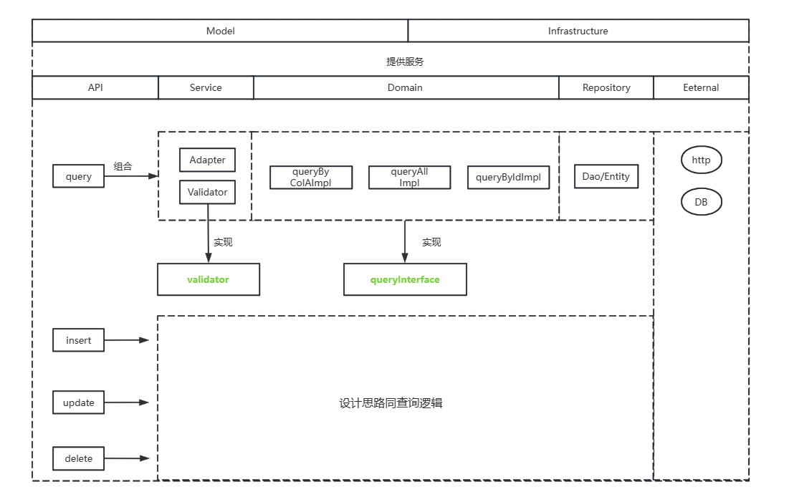

# exam-web

## 1. 写在前面的一些说明
1. 基于DDD的架构设计(就题目而言，存在过度设计的嫌疑，但如果抽象从设计的层面也说的通)
   1. 把增删改查当做四种业务场景处理，对外暴露四个接口
   2. 查询抽象出对应的领域模型，有指定id查，全查等业务模型,增删改同理
   3. 由于业务场景简单，没有使用充血模型更好发挥DDD的功能
2. 使用RestFul风格提供API接口
3. 技术选型
   1. JDK17、springboot3.0、mybatis、gradle
   2. UT框架选用Spock
4. 由于时间匆忙，代码中还有很多细节需要优化的地方，如切面日志处理，异常处理等，另外项目结构还应该根据业务场景进一步调整与优化

## 2. 设计
1. 总体架构图

2. 
